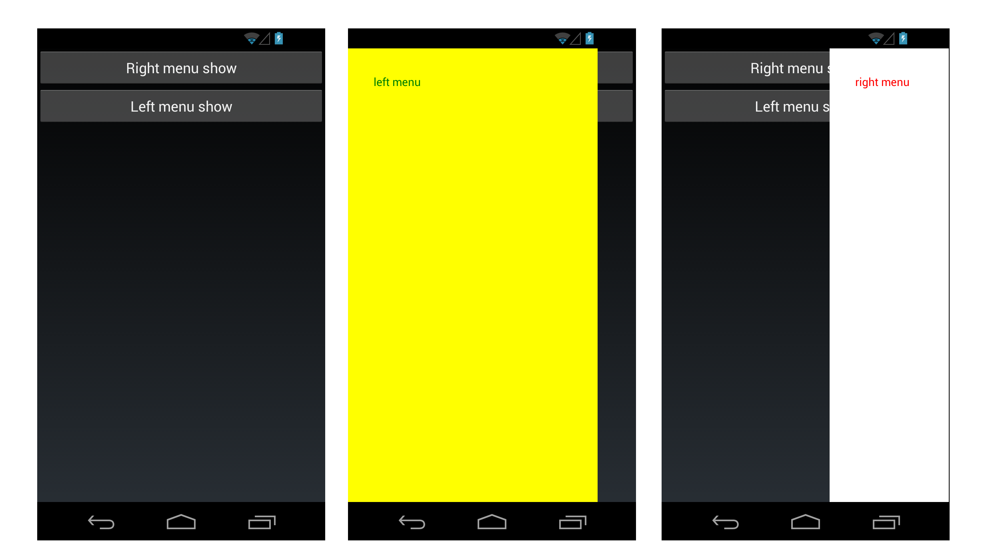

ScnSideMenu
======================
Xamarin.Forms side menu control (targeted at Android and iOS, Windows Phone is temporary unavaliable) - it lets you add sliding menus (left and right) to you application.

Control Structure
===========================================
Bellow you may see control schema:


Screenshots of the real app usign sliding menu follow (find app sources at https://github.com/ScienceSoft-Inc/XamarinDiscountsApp):


How to use the control in Xamarin.Forms app
===========================================
In order to show or hide the menu set the properties "IsShowLeftPanel" and "IsShowRightPanel" to TRUE or FALSE or use swipe gestures near screen border.

In order to have gestures working you need to have platform specific renderers initialized.

iOS:
```cs
Xamarin.Forms.Forms.Init ();
ViewGesturesRenderer.Init();
```
Android:
```cs
Xamarin.Forms.Forms.Init (this, bundle);
ViewGesturesRenderer.Init();
```
WinPhone:
```cs
Xamarin.Forms.Forms.Init ();
ViewGesturesRenderer.Init();
```

See sample usage here: https://github.com/ScienceSoft-Inc/ScnSideMenu/tree/master/ScnSideMenu/Sample/SimpleSideMenu
